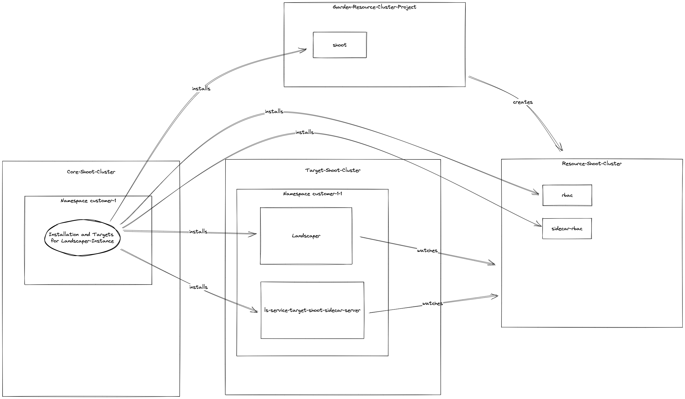

# Landscaper as a Service (LaaS) Architecture and Security Concepts

This document describes the architecture of a LaaS landscape.

## Architecture

### Architecture Overview

The overall architecture of one LaaS landscape is depicted in the following picture:


The main units are:

- Secret Store: The secret store contains the credentials for the pipeline, e.g. to access the Gardener project
  namespaces.

- Garden-LaaS-Project: This is a Garden project where the shoot clusters with the central units of a LaaS landscape
  are running

- Core-Shoot-Cluster: A Garden shoot cluster in the Garden-LaaS-Project. On this shoot cluster the Central Landscaper 
  and the LaaS component/instance is running. The LaaS uses the Central Landscaper to deploy the Landscaper instances for 
  different customers.

- Target-Shoot-Cluster: A Garden shoot cluster where the different Landscaper instances for the customer are running 
  in different namespaces. In principle a LaaS landscape might have multiple Target-Shoot-Clusters.

- Deploy-Pipeline: The Deploy-Pipeline installs the Central Landscaper as a Helm chart on the Core-Shoot-Cluster. The 
  Central Landscaper watches the Core-Shoot-Cluster for Landscaper 
  [Installations](https://github.com/gardener/landscaper/blob/master/docs/usage/Installations.md) resources. The 
  Deploy-Pipeline creates an Installation resource in the Core-Shoot-Cluster to also install the LaaS component 
  in the Core-Shoot-Cluster. The LaaS component is responsible to install Landscaper instances for the customers 
  in the Target-Shoot-Cluster(s). 

- Gardener-Resource-Cluster-Project: The Gardener project for the custom resource shoot cluster. If a customer requests 
  a Landscaper instance, the LaaS, running on the Core-Shoot-Cluster, deploys a new Landscaper instance in a new namespace 
  of the Target-Shoot-Cluster. For every new Landscaper instance, the LaaS also starts a new Resource-Shoot-Cluster
  in the Gardener-Resource-Cluster-Project. For its own deployments, the customer could create Landscaper 
  Installation resources on this Resource-Shoot-Cluster. The new Landscaper instance on the Target-Shoot-Cluster is 
  watching and processing these.

- Resource-Shoot-Cluster: Every Landscaper instance for a customer (running on the Target-Shoot-Cluster) watches 
  a different Resource-Shoot-Cluster, which is a Gardener shoot cluster in the Gardener-Resource-Cluster-Project, where 
  the customer could deploy its Landscaper Installation resources.

### Core-Shoot-Cluster and Target-Shoot-Cluster(s)

The following image gives a more detailed impression of the Core-Shoot-Cluster and the Target-Shoot-Cluster(s) and their
connections.


The Deploy-Pipeline installs the Central Landscaper on the Core-Shoot-Cluster as a helm chart deployment. The central 
Landscaper watches the Core-Shoot-Cluster for Landscaper Installations. Since the host and resource cluster of the 
Core Landscaper are equal, we can install it by deploying the 
[bundled `landscaper` helm chart](https://github.com/gardener/landscaper/tree/master/charts/landscaper) 
with its two sub charts `landscaper-rbac` and `landscaper-controller`:
- The `landscaper-rbac` helm chart deploys the ServiceAccounts used by the Landscaper controller internally, for
  watching Installations, and for creating the ValidatingWebhookConfig.
- The `landscaper-controller` chart deploys the landscaper controller and deployers.

Then the Deploy-Pipeline creates an Installation (and Target etc.) for the [LaaS component](../../.landscaper), such 
that the Central Landscaper installs it also on the Core-Shoot-Cluster. The LaaS component has the name 
*github.com/gardener/landscaper/landscaper-service* and comprises the following important parts:

- [blueprint](../../.landscaper/blueprint/blueprint.yaml)
- [resources](../../.landscaper/resources.yaml)
- [component-references](../../.landscaper/component-references.yaml)

To enable the LaaS to deploy e.g. Landscaper Instances for customers to the Target-Shoot-Clusters, a 
[ServiceTargetConfig](../usage/ServiceTargetConfigs.md) object is deployed on the Core-Shoot-Cluster for every 
Target-Shoot-Cluster. Every ServiceTargetConfig references a secret containing a kubeconfig providing access to one 
Target-Shoot-Cluster. The kubeconfig is created for a service account on the Target-Shoot-Cluster.

### Landscaper-Instance Creation

The following image gives a more detailed overview how Landscaper instances are created for a customer.


For every customer there is a dedicated namespace on the Core-Shoot-Cluster. To get a Landscaper Instance a 
user/customer/operator creates a [LandscaperDeployment](../usage/LandscaperDeployments.md) custom resource in this 
namespace. The LaaS instance in the Core-Shoot-Cluster watches for such custom resources and creates an 
[Instance](../usage/Instances.md) custom resource for every LandscaperDeployment. For every Instance, the LaaS deploys an 
[Installation](https://github.com/gardener/landscaper/blob/master/docs/usage/Installations.md) for a Landscaper Instance.

The LaaS furthermore creates two [Targets](https://github.com/gardener/landscaper/blob/master/docs/usage/Targets.md)
as input for the Installation containing the credentials

- for a Target-Shoot-Cluster. These credentials are fetched from one of the ServiceTargetConfig custom resources and 
  are used to install all required artefacts for the Landscaper Instance on a Target-Shoot-Cluster.

- for the Garden project Garden-Resource-Cluster-Project to create a Resource-Shoot-Cluster on which the customer 
  can later deploy its Landscaper resources like Installations, Targets, etc.

The Central Landscaper watches for the Installations and executes them.

### Landscaper Instance Details

A Landscaper Instance is defined by [this](../../.landscaper/landscaper-instance) component. The component 
contains a [blueprint](../../.landscaper/landscaper-instance/blueprint/installation/blueprint.yaml) with five 
[sub installations](https://github.com/gardener/landscaper/blob/master/docs/usage/Blueprints.md#nested-installations), 
which are deploying:

- **[shoot](../../.landscaper/landscaper-instance/blueprint/installation/shoot-cluster-subinst.yaml)**: 
  A new shoot custom resource in the Garden-Resource-Cluster-Project for which the Gardener creates a new 
  Resource-Shoot-Cluster
- **[landscaper](../../.landscaper/landscaper-instance/blueprint/installation/landscaper-deployment-subinst.yaml)**: 
  A new Landscaper and its deployers in new namespace on one of the Target-Shoot-Clusters. This Landscaper is watching 
  and processing the Landscaper resources on the Resource-Shoot-Cluster.
- **[ls-service-target-shoot-sidecar-server](../../.landscaper/landscaper-instance/blueprint/installation/sidecar-subinst.yaml)**: 
  Two controller handling the access rights of the customer/users to the Resource-Shoot-Cluster as well as the 
  creation of custom namespaces on that cluster.
- **[rbac](../../.landscaper/landscaper-instance/blueprint/installation/landscaper-rbac-subinst.yaml)**: A 
  service account with the right permissions, providing the new Landscaper access to the Resource-Shoot-Cluster.
- **[sidecar-rbac](../../.landscaper/landscaper-instance/blueprint/installation/sidecar-rbac-subinst.yaml)**: 
  A service account with the right permissions providing the controllers installed by 
  ls-service-target-shoot-sidecar-server access to the Resource-Shoot-Cluster.

The following picture gives an overview about the different sub installations:



The installed Landscaper Instance watches the just created Resource-Shoot-Cluster on which the customer/user could 
deploy and maintain its Installations.

### Details of a Resource-Shoot-Cluster

Initially a Resource-Shoot-Cluster has two namespaces which are interesting with respect to the Landscaper Instance:

- namespace ls-system: This namespace mainly contains the Installations for the deployers of the Landscaper which 
  is part of the Landscaper-Instance. Customers/users have no access to this namespace. 

- namespace ls-user: This namespace allows users to control the access to the Resource-Shoot-Cluster as well as to 
  maintain the customer namespaces. It is created during the startup of the controller deployed by the sub installation
  ls-service-target-shoot-sidecar-server. 

#### Controlling user access to the Resource-Shoot-Cluster

In the namespace ls-users there exists one custom resource *subjects* of type 
[SubjectList](../../pkg/apis/core/v1alpha1/types_subjectlist.go). 

```bash
kubectl get subjectlists -n ls-user subjects
NAME       AGE
subjects   ...
```

At the beginning this custom resource looks as follows:

```yaml
apiVersion: landscaper-service.gardener.cloud/v1alpha1
kind: SubjectList
metadata:
  name: subjects
  namespace: ls-user
  ...
spec:
  subjects: []
```

To create an initial access for a user, a cluster administrator creates a service account in the namespace ls-user:

```bash
kubectl create sa -n ls-user <name of service account>
```

Next, the administrator adds an entry for the new service account to the `SubjectList` *subjects* such that it looks 
as follows:

```yaml
apiVersion: landscaper-service.gardener.cloud/v1alpha1
kind: SubjectList
metadata:
  name: subjects
  namespace: ls-user
  ...
spec:
  subjects:
  - kind: ServiceAccount
    name: <name of service account>
```

Now, the controllers deployed by ls-service-target-shoot-sidecar-server automatically add this service account to 
particular predefined role-bindings and cluster-role-bindings, with the exactly right permissions a user needs to 
work with a Resource-Shoot-Cluster, e.g. to create Landscaper Installations, Targets etc. 

Next, the cluster admin can fetch a token with a restricted lifetime for the new service account with the
[token request API](https://kubernetes.io/docs/reference/kubernetes-api/authentication-resources/token-request-v1/#TokenRequest):

```bash
kubectl create token -n ls-user testserviceaccount --duration=48h

eyJhbGciOiJSUzI1NiIsImtpZCI6IkdzM1J...
```

A kubeconfig with this token allows a user to access the Resource-Shoot-Cluster and also to refresh its token when 
required. With this access data, the user can also create additional service accounts, add them to the `SubjectList` 
*subjects*. The user is not allowed to create or modify roles, cluster-roles, role-bindings or cluster-rolebindings to
get more permissions.

As described above, a Landscaper Instance is deployed when a [LandscaperDeployment](../usage/LandscaperDeployments.md)
is created. In a `LandscaperDeployment` you could also specify some OIDC configuration for the Resource-Shoot-Cluster, 
allowing end users to be authenticated via OIDC. To give such an authenticated user the required end user permissions,
you might add its email to the `SubjectList` *subjects*:

```yaml
apiVersion: landscaper-service.gardener.cloud/v1alpha1
kind: SubjectList
metadata:
  name: subjects
  namespace: ls-user
  ...
spec:
  subjects:
  - kind: User
    name: <email of user>
```

Again the controllers of ls-service-target-shoot-sidecar-server automatically add this user to the right
predefined role-bindings and cluster-role-bindings, in the same way as for the service accounts above. 

If the OIDC flow also provides group information, another possibility to authorize users is to add some of their groups
to the `SubjectList` *subjects*:

```bash
apiVersion: landscaper-service.gardener.cloud/v1alpha1
kind: SubjectList
metadata:
  name: subjects
  namespace: ls-user
  ...
spec:
  subjects:
  ...
  - Kind: Group
    Name: <some group>
```

Again the controllers of ls-service-target-shoot-sidecar-server automatically add this group to the right
predefined role-bindings and cluster-role-bindings, in the same way as for the service accounts above.

The following image gives a more detailed descriptions of the involved roles, cluster-roles etc. The namespaces 
*cu-* are so-called customer namespaces on the Resource-Shoot-Cluster and will be described in more detail below:


#### Controlling Customer Namespaces on the Resource-Shoot-Cluster

A user, with access to the Resource-Shoot-Cluster as described before, is only allowed to create Landscaper resources 
like Installations, Targets etc. in so-called customer namespaces. A customer namespace is a normal namespace on the
Resource-Shoot-Cluster with a name starting with the prefix *cu-*. 

To create such a namespace the user must create a 
*[namespaceRegistration](../../pkg/apis/core/v1alpha1/types_namespaceregistration.go)* object in the namespace ls-user
with the same name as the namespace. The following manifest for example would create a customer namespace *cu-test*:

```yaml
apiVersion: landscaper-service.gardener.cloud/v1alpha1
kind: NamespaceRegistration
metadata:
  name: cu-test
  namespace: ls-user
spec: {}
```

The controllers of ls-service-target-shoot-sidecar-server automatically creates the required roles, role-bindings etc. 
for all entries in the `SubjectList` *subjects* in every newly created customer namespace (see the details in the image 
before). 


## 3 Questions and open points

### Open Points

- Describe logging stack, monitoring, nginx controller

