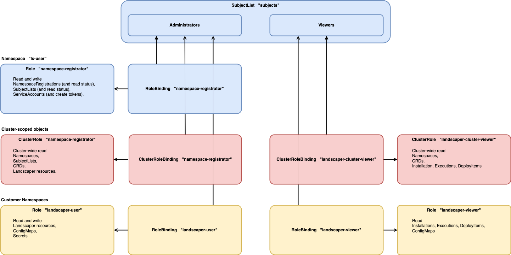

# User Roles on Resource Clusters

## SubjectList

The users of a resource cluster are divided into **administrators** and **viewers**. They are maintained in a single
SubjectList custom resource on the resource cluster (namespace `ls-user`, name `subjects`).

```yaml
apiVersion: landscaper-service.gardener.cloud/v1alpha1
kind: SubjectList
metadata:
  name: subjects
  namespace: ls-user
spec:
  subjects:
    - kind: ("User" | "Group" | "ServiceAccount")
      name: ...
    ...
  viewerSubjects:
    - kind: ("User" | "Group" | "ServiceAccount")
      name: ...
    ...
```

The administrators are listed in `spec.subjects`, and the viewers in `spec.viewerSubjects`.

Administrators can modify the SubjectList.
The SubjectList is created empty upon startup of the sidecar pod. A first user of the customer is inserted as 
admin during the on-boarding. As admin this user can then add further users.


## Roles and Bindings

There are three (Cluster)Roles which define the permissions of the administrators, and two (Cluster)Roles for the viewers.
You can find an overview in the diagram below, and the exact definitions here:
- [cluster role definitions](../../pkg/controllers/subjectsync/clusterroledefinition.go)
- [role definitions](../../pkg/controllers/subjectsync/roledefinition.go)

Roughly speaking, the role in namespace `ls-user` allows to maintain the SubjectList and NamespaceRegistrations
(shown in blue in the diagram).
The ClusterRoles allow cluster-wide read commands (shown in red). 
Finally, the roles in the customer namespaces (generated by NamespaceRegistrations) allow to maintain/view 
Landscaper resources (shown in yellow).

For each role there is a corresponding binding.
The SubjectList controller keeps the `subjects` of the bindings in sync with the `subjects` (resp. `viewerSubjects`)
in the SubjectList.

The NamespaceRegistration controller creates the roles and bindings in new the customer namespaces.


