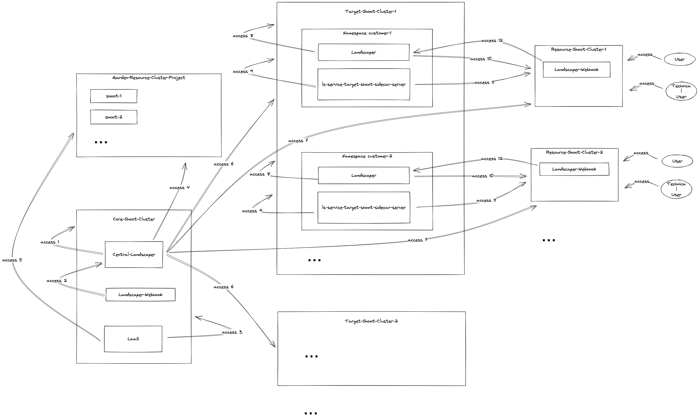

# Landscaper as a Service (LaaS) Security 

This document describes the security concepts of a LaaS landscape. The
[architecture document](./architecture.md) is a prerequisite of the following description.

## Component communication

The different types of communication between the components of a LaaS landscape are as follows:

- Pod to API server communication: Secured by mTLS by default 
  ([see](https://kubernetes.io/docs/concepts/security/controlling-access/)). 

- API server/Admission Controller to component communication: When a dynamic webhook is configured
  ([see](https://kubernetes.io/docs/reference/access-authn-authz/extensible-admission-controllers/)) the communication 
  is also based on mTLS (self-signed certificates) and the component endpoint called by the API server/Admission 
  Controller is exposed by a load balancer which is not terminating TLS.

The following image shows all communication channels of a LaaS landscape.



In the following the different channels are described in more detail:

- access 1 (Pod to API server communication): The Central-Landscaper accesses and manipulates kubernetes objects like
  Installations, Executions, Pods, etc. via the API server of the Core-Shoot-Cluster.

- access 2 (API server/Admission Controller to component communication): The Landscaper-Webhook on the Core-Shoot-Cluster
  is a dynamic webhook controlling the creation of Landscaper Installation manifests on the Core-Shoot-Cluster. 
  It calls an endpoint of the Central-Landscaper.

- access 3 (Pod to API server communication): The LaaS accesses and manipulates custom resources on the Core-Shoot-Cluster
  like LandscaperDeployments, ServiceTargetConfigs, Installations, Targets etc. via the API server of the 
  Core-Shoot-Cluster.

- access 4 (Pod to API server communication): The Central-Landscaper accesses and manipulates shoot custom resources and 
  fetches token in the namespace of the Garden-Resource-Cluster-Project located on the Garden cluster, via the API 
  server of the Garden Cluster.

- access 5 (Pod to API server communication): The LaaS accesses shoot custom resources of the Garden-Resource-Cluster-Project 
  located on the Garden cluster, via the API server of the Garden Cluster. It requires the names of the existing shoot 
  clusters to infer a new one.

- access 6 (Pod to API server communication): The Central-Landscaper accesses and manipulates kubernetes objects to
  install and maintain the Landscaper and ls-service-target-shoot-sidecar-server components on the Target-Shoot-Clusters
  via their API servers.

- access 7 (Pod to API server communication): The Central-Landscaper accesses and manipulates kubernetes objects to
  install service accounts and RBAC objects on the Resource-Shoot-Clusters via their API servers.

- access 8 (Pod to API server communication): The Landscaper components on the Target-Shoot-Clusters access and 
  manipulate kubernetes objects like Secrets, Service Accounts, Pods, etc. via their API servers. It also  
  installs the deployer in the customer namespace on the Target-Shoot-Cluster.

- access 9 (Pod to API server communication): The ls-service-target-shoot-sidecar-server components on the 
  Target-Shoot-Clusters have the default access to kubernetes objects on their clusters via the corresponding API 
  servers.

- access 10 (Pod to API server communication): The Landscaper components on the Target-Shoot-Clusters access and
  manipulate kubernetes objects like Installations, Executions, Secrets etc. on the Resource-Shoot-Clusters via their
  API servers.

- access 11 (Pod to API server communication): The ls-service-target-shoot-sidecar-server components on the
  Target-Shoot-Clusters manipulate kubernetes objects like namespaces, CRDs, SubjectLists etc. on the 
  Resource-Shoot-Clusters via their API servers.

- access 12 (API server/Admission Controller to component communication): The Landscaper-Webhooks on the 
  Resource-Shoot-Clusters are dynamic webhooks controlling the creation of Landscaper Installation manifests on the 
  clusters. The calls endpoints of the corresponding Landscapers on the Target-Shoot-Clusters.

## Credentials and Credential Rotation for a Landscaper as a Service (LaaS) landscape

This chapter describes which credentials are used in a LaaS landscape and how they are created and rotated.

According to the Gardener security recommendations we assume that all involved Gardener shoot clusters are switched
to non-static secrets.

If possible the following goals should be achieved:

- Credentials to access a server should be stored on the client side only.
- Credentials have a restricted lifetime of not more than 90 days.
- No static credentials for shoot clusters. (Gardener recommendation).
- No Gardener-Service-Account with Service Account Manager role (Gardener recommendation).

### Prerequisites

The following summarizes the base techniques to get access to Gardener projects and shoot clusters:

- Gardener-Service-Account: A project member with sufficient permissions could create Gardener-Service-Accounts with
  different roles for a Gardener project. For a description of the roles, see
  [Create a Service Account](https://gardener.cloud/docs/dashboard/usage/gardener-api/#create-a-service-account).

- Gardener-Service-Account-Kubeconfig: To access a Gardener project, you could download a kubeconfig for a
  Gardener-Service-Account with the help of the Gardener Dashboard. The lifetime of this kubeconfig is 90 days.
  As an alternative to get a token to access a Gardener Project you can use the [token request API](https://kubernetes.io/docs/reference/kubernetes-api/authentication-resources/token-request-v1/#TokenRequest):
  ```
  kubectl create --kubeconfig=<path to kubeconfig for Gardener-Service-Account of the project with SAM role> \
    --raw "/api/v1/namespaces/garden-<garden-project-name>/serviceaccounts/<service-account-name>/token" \
    -f <(echo '{"spec":{"expirationSeconds": <some-duration>}}') \
    | jq -r .status
  ```

- Shoot-Cluster-Admin-Kubeconfig: To get a cluster-admin kubeconfig for a Gardener shoot cluster you can use the
  [shootsadminkubeconfig-subresource](https://github.com/gardener/gardener/blob/master/docs/usage/shoot_access.md#shootsadminkubeconfig-subresource).
  The lifetime of the tokens is at most 24 hours. To get such a token you must be an admin member of a project or
  you have an admin Gardener-Service-Account-Kubeconfig at hand.

- Shoot-Cluster-Kubeconfig: Kubeconfig with a longer lifetime and particular permissions for accessing a Gardener
  shoot cluster could be constructed by creating a service account (with RBAC rules) in the shoot cluster and fetching
  kubeconfigs/token using again the
  [token request API](https://kubernetes.io/docs/reference/kubernetes-api/authentication-resources/token-request-v1/#TokenRequest).
  With this approach the credentials are not stored in the shoot cluster and have a restricted lifetime.
  In principle, it is still possible to create the credentials by deploying a secret for a service account. Such
  credentials (the automatically injected token) have the disadvantages to have no restricted lifetime and exist on the
  client and server side. Nevertheless, they must be also be rotated (by deleting and recreating the secret).

In the following we will reference to the names defined here: Gardener-Service-Account,
Gardener-Service-Account-Kubeconfig, Shoot-Cluster-Admin-Kubeconfig, Shoot-Cluster-Kubeconfig

### Root Credentials

Credential rotation could not be done completely automatically. There must be some root credentials which has to be
created and rotated manually by a user with the corresponding permissions. These root credentials are stored in the
Secret Store.

#### Root Credentials for Gardener Projects

The Gardener-Service-Account-Kubeconfigs for the Gardener-LaaS-Project and the Gardener-Resource-Cluster-Project
are root credentials for a LaaS landscape. These must be created and rotated manually by a user with
`Service Account Manager` role.

The corresponding Gardener-Service-Accounts must have the `Admin` role, but not the `Service Account Manager` role.
This prevents to request new tokens and is a Gardener recommendation. If a service account is allowed to request
new tokens and one such token leaks, an attacker could create new tokens forever and rotation could never invalidate
them, except the corresponding service account is replaced.

#### Root Credentials for GCP Projects

The Gardener shoot cluster custom resources in the Gardener-LaaS-Project and the Gardener-Resource-Cluster-Project
references secrets containing the secret key of a [GCP](https://cloud.google.com/) service account. This is required
for the creation and maintenance of shoot clusters by the Gardener. It is recommended to use one secret in both Garden
projects each containing the secret key of a service account of a different GCP project.

The secret keys for the GCP service account are root credentials of a LaaS landscape. The secret keys must be created
and rotated manually by a human, and stored and replaced in the corresponding k8s secrets of the Gardener-LaaS-Project
and the Gardener-Resource-Cluster-Project by the Deploy-Pipeline.

#### Image Pull Secrets

Image pull secrets are another group of root credentials stored in the Secret Store which must be rotated manually.

### Deploy-Pipeline

This Chapter describes which credentials are created and rotated with every execution by the Deploy-Pipeline.

**Credentials for GCP Project:** In the Gardener projects Gardener-LaaS-Project and Gardener-Resource-Cluster-Project
there are secrets containing the secret key of a GCP service account. The shoot recourses in these projects are
referencing these secrets, and the Gardener uses the corresponding GCP secret key to create and maintain a Gardener
shoot cluster in the GCP infrastructure.

The Deploy-Pipeline must update the GCP secrets keys in these secrets of the Gardener projects with
the latest GCP secret keys stored in the Secret Store. The update of the secrets in the Gardener projects is done
by the Deploy-Pipeline with the Gardener-Service-Account-Kubeconfigs, also stored in the Secret-Store.

**Credentials in ServiceTargetConfigs:** The pipeline must rotate the credentials stored in the ServiceTargetconfigs.
This can be done as follows:

- With the Gardener-Service-Account-Kubeconfig for the Gardener-LaaS-Project stored in the Secret Store, create a
  Shoot-Cluster-Admin-Kubeconfig for a Target-Shoot-Cluster.

- With the Shoot-Cluster-Admin-Kubeconfig create a new token for the service account used for the ServiceTargetConfig.
  and replace the old token with the new one.

The ServiceTargetConfigs might be created manually or automatically by the Deploy-Pipeline. The only important point is
that the token in the kubeconfigs must be rotated with every deployment.

**Credentials when deploying the Central Landscaper:** The Helm deployment of the Central Landscaper is executed by the
Deploy-Pipeline with a Shoot-Cluster-Admin-Kubeconfig for the Core-Shoot-Cluster, which could be fetched as described before.
We deploy the Central Landscaper via the
[bundled `landscaper` helm chart](https://github.com/gardener/landscaper/tree/master/charts/landscaper).
No kubeconfig is provided as Helm values for the resource and webhook cluster because this is the same as the host cluster.
The landscaper deployment creates the corresponding ServiceAccount and mounts their token into the landscaper pod (see
[ServiceAccount Admission Controller](https://kubernetes.io/docs/reference/access-authn-authz/service-accounts-admin/#serviceaccount-admission-controller)),
providing automatic token rotation.

**Credentials when deploying the LaaS:** To deploy the LaaS the Deploy-Pipeline creates on the Core-Shoot-Cluster

- a Target containing the access information for the Core-Shoot-Cluster where the LaaS should be installed

- a Secret containing the access information of the OCI registry containing the Component Descriptor of the LaaS, the
  container images etc.

- a [Context](https://github.com/gardener/landscaper/blob/master/docs/usage/Context.md) object referencing the
  secret with the access information of the OCI registry

- a Secret containing the access information for the Garden-Resource-Cluster-Project

- an Installation for the LaaS instance referencing the Target and the Context object

The creation of these objects is executed with a Shoot-Cluster-Admin-Kubeconfig for the Core-Shoot-Cluster, fetched
as described before.

The Target is created and rotated by the Deploy-Pipeline as follows:

- With the Gardener-Service-Account-Kubeconfig for the Gardener-LaaS-Project, create a Shoot-Cluster-Admin-Kubeconfig
  for Core-Shoot-Cluster.

- Use the Shoot-Cluster-Admin-Kubeconfig for the Core-Shoot-Cluster to create a service account with the required
  permissions for the Core-Shoot-Cluster and create a Shoot-Cluster-Kubeconfig for this service account. This kubeconfig
  is stored in the Target (or the referenced secret).

The Secret containing the access information of the OCI registry just copies the correspponding information from the
Secret-Store.

The Secret containing the access information for the Garden-Resource-Cluster-Project is also created from the
corresponding data in the Secret-Store.

The Installation to deploy the LaaS requires some credentials as input data:

- The name of the just created Secret containing the access information for the Garden-Resource-Cluster-Project.

- The name of the just created Secret containing the access information of the OCI registry containing the
  Component Descriptor.

- The name of the Secret in the Garden-Resource-Cluster-Project, containing the secret key of a GCP service account
  which is used by Gardener to create and maintain shoot clusters.

### List of Credentials for Rotation

- Manually rotated credentials in Secret Store
    - Gardener-Service-Account-Kubeconfig for Gardener-LaaS-Project
    - Gardener-Service-Account-Kubeconfig for Gardener-Resource-Cluster-Project
    - Secret key for the GCP service account of the two GCP projects referenced by the shoot clusters

- Automatically rotated by the Deploy-Pipeline
    - Secrets containing the GCP secret keys in the Garden-Projects Gardener-LaaS-Project and
      Gardener-Resource-Cluster-Project referenced by shoot resources
    - Credentials stored in the ServiceTargetConfigs
    - Target used to install the LaaS
    - Secret containing Gardener-Service-Account-Kubeconfigs for the Gardener-Resource-Cluster-Project provided as input
      to the LaaS installation.

## 3 Questions and open points

- Describe internal credentials of Landscaper

- Describe internal credentials of LaaS + new controller and how to rotate them?