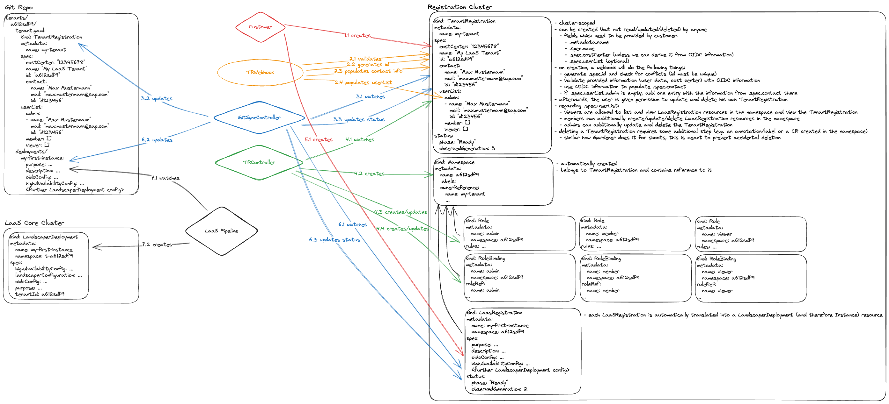

# LaaS Onboarding System (LOS)

Goal: To have a fully automated onboarding system, which allows (authenticated) users to request Landscaper instances for their respective tenant.

## Concept

## CRDs
### TenantRegistration
cluster-scoped.
Created by a user to create a tenant (=namespace) in which laas instances can be ordered. Contains an automatically populated CreatedBy field and a status.namespace field with the tenants namespace.

### LosSubjectList
namespace-scoped.
Created by the TenantRegistrationController when a new namespace is created for a tenant. Can be editet by the user with the appropriate role (see section Roles) and is translated to the subject references in the Role- and ClusterRoleBindings (created by the TenantRegistrationController).

### InstanceRegistration
namespace-scoped.
The InstanceRegistration is created by the user to order a new landscaper instance. The user provides some landscaper-specific configuration values in the CR. The status field will be populated by the InstanceRegistrationController with progress informtion and finally with the kubeconfig for accessing the resource cluster (that is watched by the landscaper instance).
## Components

### TenantRegistrationWebhook
The TenantRegistrationWebhook is a mutating webhook to have access to the OIDC information (user). This information is written in the createdBy field.

#### Original Ideas:
This is a mutating webhook which has the following tasks:
- on creation
  - fill in primary contact based on auth information from the OIDC request
  - generate tenant id and check for conflicts (existing namespaces in the cluster)
  - if no userlist is specified, the primary contact is used as admin
- on update
  - ensure that tenant id is not modified
  - ensure that only admins can modify the resource
  - ensure that the primary contact is not changed (requires ticket?)
  - ensure that the primary contact is not removed from admins?
- on deletion
  - safeguard against accidental deletion
    - only allow deletion if a special annotation/CR/whatever is present

Not sure if we can do this with a single mutating webhook or if an additional validating webhook is required or would be better.

### TenantRegistrationController

The TRC is responsible for setting up the tenant namespaces. It watches TenantRegistrations and reacts as follows:
- on creation / on update when the state shows that the version has not been synced to git yet
  - don't do anything, as the tenant has to be synced to the git repo first
- on update when the sync is completed
  - check if a namespace for the TR exists and create it, if not. The namespace name is the tenantID
  - create a Role and RoleBinding that allows actions in the tenant namespace for different roles
  - create a ClusterRole (with resource name restriction) and ClusterRoleBinding to access only their tenantregistration
  - create LosSubjectList and add the createdBy user as admin

### LosSubjectSyncController

The LSSC handles the permission assignment of the precreated roles by the TRC and the subjects in the LosSubjectList CR.

- change of the LosSubjectListCR
  - update the role bindings for all roles with the subjects from the subjectlist

### InstanceRegistrationController

The IRC is responsible for syncing the InstanceRegistration spec into the LandscaperDeployment on the core cluster and the collected status of LandscaperDeployment and Instance (mainly error, user kubeconfig) back to the InstanceRegistration.
For simpler coding, this is done with two controller, both featuring a unidirectional sync between InstanceRegistration and LandscaperDeployment.

#### InstanceRegistrationSyncController: InstanceRegistration --> LandscaperDeployment

The spec from the InstanceRegistration is transformed into the LandscaperDeployment spec and the tenantId is programmatically set with the tenant namespace name (=tenantId).
Additionally, the controller adds a namespace and name label to the LandscaperDeployment to point back to the InstanceRegistration. A forward reference to the LandscaperDeployment is written into the InstaneRegistration status field.

#### LandscaperDeploymentSyncController: LandscaperDeployment --> InstanceRegistration

Some status fields from the LandscaperDeployment and the UserKubeconfig from the Instance are translated back to the InstanceRegistration refered in the label.

### GitSyncController

This controller watches `TenantRegistration` and `LaaSRegistration` resources and fulfills the following tasks:
- for TenantRegistrations
  - when a TR is created or updated, the change is persisted by syncing the TR into a git repository
    - basically, the whole manifest (without `.metadata`, except for `.metadata.name`, and without `.status) is dumped into the repo
      - this allows for easy restoration in case the TRs in the cluster are lost for some reason
    - the current state of the sync is reflected via the TR's `.status.phase` and `.status.observedGeneration` fields
- for LaaSRegistrations
  - when a LR is created or updated, the spec of the resource is synced into a git repository
    - the current state of the sync is reflected via the LR's `.status.phase` and `.status.observedGeneration` fields

