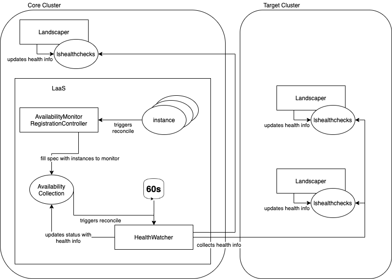

# Availability Monitoring

Availability Monitoring of the LaaS monitors landscaper instances and notifies in case of unavailability. This includes the landscaper on the core cluster itself and all LaaS-provisioned customer landscaper.

## Architecture

Each landscaper periodically writes its own availability status in a custom resource `LsHealthCheck`. For the overall availability status, this CR have to be collected and aggregated.

The monitoring consists of one additional custom resource `AvailabilityCollection` to aggregate all availability stati. Its spec contains a list of all `Instances` of customer landscapers that should be monitored. The status field contains the collected stati from the `LsHealthCheck` of the landscaper instance. This CR is used by multiple controller as shown below.



### AvailabilityMonitorRegistrationController

The first controller `AvailabilityMonitorRegistrationController` reconciles on `Instance` resource and writes all insances into the `AvailabilityCollection` spec, that fullfill the criteria:

1. Instance contains an existing installation.
1. Installation is not in state progressing (installation or updates from landscapers should not count as down and should be checked manually for success)

### Healthwatcher

The `HealthWatcher` controller runs on `AvailabilityCollection` spec change or periodically and collects all availability stati from the `LsHealthCheck` resources. Additionally, the status from the landscaper on the same core cluster is collected to ensure laas operability.
Each `LsHealthCheck` resource has a `LastRun` timestamp. A configureable timeout may set the status for the landscaper to `Failed`, if the `LastRun` field is too old. Failed checks will be logged.

### AVUploader

The AVUploader runs on `AvailabilityCollection` status change (so every time the HealthWatcher updates the status or at least the `LastRun` field) and uploads the availability to the AV Service. One AV monitoring covers all provided landscapers of one LaaS, therefore une unavaiable landscaper will result in a DOWN reporting for this LaaS. Additionally, all failed instances will be reported to AV Service and can be seen in the dashboard.

## Configuration

The laas-config file can be used for configuration:

```yaml
availabilityMonitoring:
  #the name of the AvailabilityCollection CR
  availabilityCollectionName: availability

  #the namespace of the AvailabilityCollection CR
  availabilityCollectionNamespace: laas-system

  #the namespace of the landscaper in the same core cluster
  selfLandscaperNamespace: landscaper

  #the interval, in which the HealthWatcher will check all LsHealthCheck resources
  periodicCheckInterval: 1m

  #the timeout, at which a non-updated LsHealthCheck resource will be seen as Failed
  lsHealthCheckTimeout: 5m

  #upload configuration for an AV Service
  availabilityService:
    url:
    apiKey:
    timeout:
```